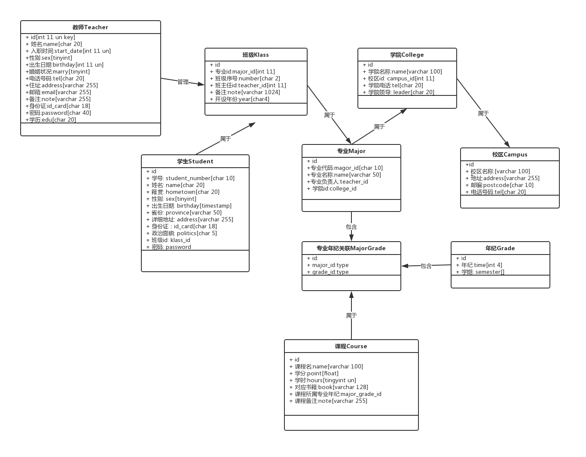

# Student-Information-Manage-System
项目用于学习和实践所学技术使用，如phpexcel，redis等等。目前会尽量完善功能。

# 系统用户
* 默认教师用户，用户名老王 密码123

# 系统说明
* 开发软件：学生信息管理系统
* 使用对象：大学

# 系统需求分析

该学生信息管理系统涉及到学生、教师、系统管理员、校区、专业、班级、学生成绩、课程。
所有用户需输入账号、密码登录进入系统；管理员进入系统后可对学生、老师、校区、专业、班级、
课程进行增删改查操作；学生进入系统，查看成绩、查看和修改自己的信息；老师进入系统后，对自
己这门课程的学生设置课程成绩、查看和修改自己的信息，查看学生的信息和成绩、以及统计分析学生
的成绩。

管理员为班级设置年级和专业，为专业设置课程，为专业的每门课程设置老师，为学生设置班级。一个班级
有多门课程(C语言程序设计、高数1、外语等等)，班级的每门课程可以有多名老师，一个老师可以有多门课程；
只有课程的主讲老师可以为学生登记成绩。

# 学生信息管理系统类图

# 已完成功能
* 教师管理
* 班级管理
* 学生管理
* 登录控制

# 待完善功能
* 使用bootstrap美化界面
* 班级查询，学生查询，课程查询
* excel文件导出